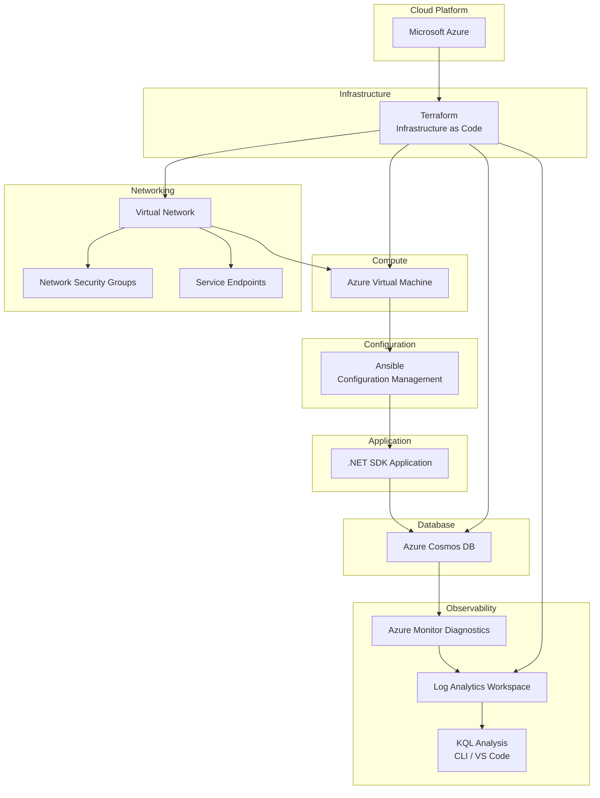
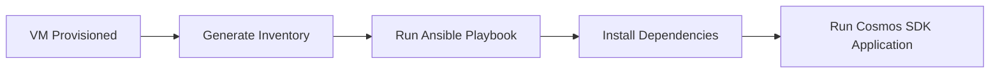

# Azure Cosmos DB Data Platform

This project explores how to build an automated data ingestion platform for Azure Cosmos DB while keeping the infrastructure reproducible and the database costs efficient.

The project started with a practical engineering question:
```bash
 🤔 How might we efficiently ingest large volumes of data into Cosmos DB 
while keeping the infrastructure fully automated and minimizing RU costs?
```

To explore this, the platform evolves across four phases:

1. Validating Cosmos DB SDK connectivity  
2. Designing a high-efficiency batch ingestion strategy  
3. Automating the entire infrastructure and deployment pipeline  
4. Optimizing Cosmos DB container indexing policies for common and query-specific workloads
---


# System Architecture



## Key Engineering Decisions

🤔 How do I ingest data efficiently?
- Used Cosmos DB TransactionalBatch API to reduce network overhead
- Grouped writes per partition to improve throughput efficiency
---

Observability and Performance Monitoring
🤔 How do I automate monitoring of RU consumption after deployment and application interaction with the database?

Created log-analytics-monitor.sh bash scripts which fetches the workspace id automatically and ingest it into the monitoring KQL query.

Used Kusto Query Language (KQL) to analyze:
Request Unit (RU) consumption
Batch ingestion costs
Container-level usage
Throttling events (HTTP 429)


### Reproducible Infrastructure

All cloud resources are provisioned using Terraform, including:

- Virtual Network
- Network Security Groups
- Service Endpoints
- Azure Virtual Machine
- Azure Cosmos DB Account
- Log Analytics Workspace
- Cosmos DB Diagnostic Settings

This ensures the entire platform — including observability — is fully reproducible from code.


### Built-In Observability

Cosmos DB diagnostic logs are configured during Terraform deployment, enabling operational telemetry from the moment the infrastructure is created.

Telemetry is streamed to Azure Monitor / Log Analytics, where Kusto queries can analyze:

- Request Unit (RU) consumption
- Container activity
- Batch operation costs
- Throttling events (HTTP 429)

Example query used during performance analysis:

``` bash
AzureDiagnostics
| where Category contains "DataPlane"
| where isnotempty(databaseName_s)
| where isnotempty(collectionName_s)
| summarize totalRU=sum(todouble(requestCharge_s))
  by bin(TimeGenerated,5m), databaseName_s, collectionName_s
| order by TimeGenerated desc
```

``` bash 
The file name can be found in azure-data-platform/terraform/config-files/log-analytics-monitor.sh
```

This allows engineers to observe ingestion workload behavior directly from diagnostic logs without having to log on to the portal.

Description |
|-----|-----|
| Phase 1 | Cosmos DB SDK connectivity validation |
| Phase 2 | Transactional batch ingestion engine |
| Phase 3 | Automated infrastructure deployment and orchestration |

Detailed documentation:

- [Phase 1 — SDK Connectivity](docs/phase-1-sdk-connection.md)
- [Phase 2 — Transactional Batch Operations](docs/phase-2-transactional-batch.md)
- [Phase 3 — Infrastructure Automation](docs/phase-3-infra-automation.md)

---

# Infrastructure Automation

Infrastructure resources are provisioned using Terraform.

<p align="center">

</p>

Deployment workflow:


---

# Configuration Management

After infrastructure deployment, Ansible configures the virtual machine and prepares the environment for application execution.




# Deployment Validation 

Terraform Infrastructure Deployment

<p align="center">  </p>


VM Connectivity Validation

<p align="center">  </p>


<p align="center">  Successful Ansible Deployment  </p>

<p align="center">  </p>

Cosmos DB Data Explorer showing documents inserted by the automated batch ingestion process

<p align="center">  </p>

<p align="center">  </p>


