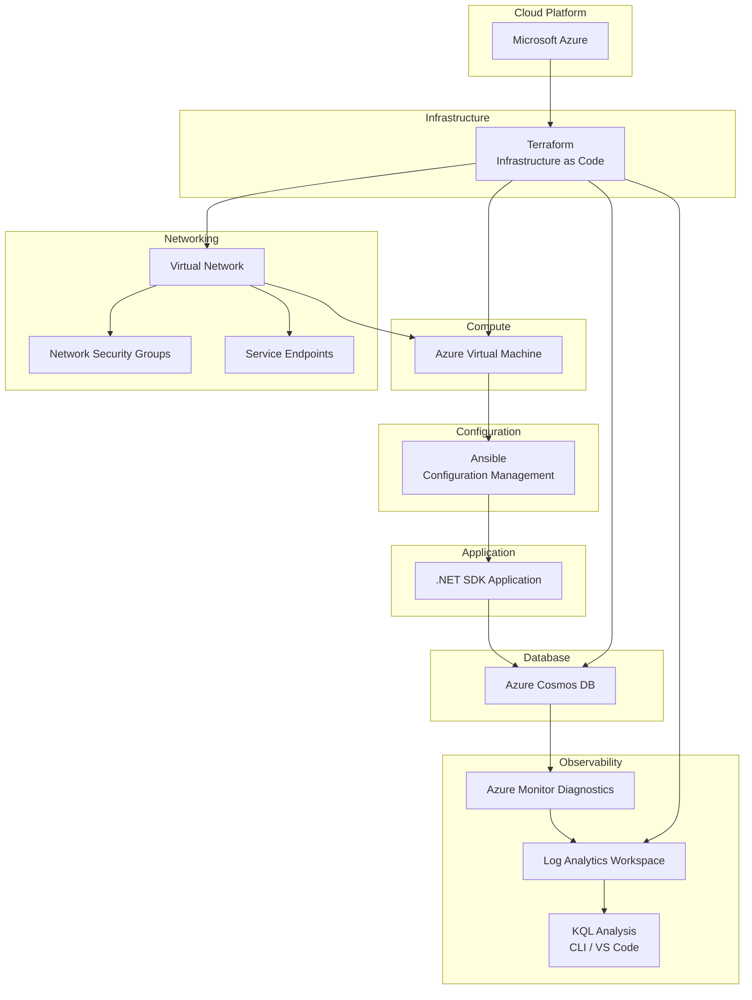
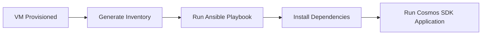
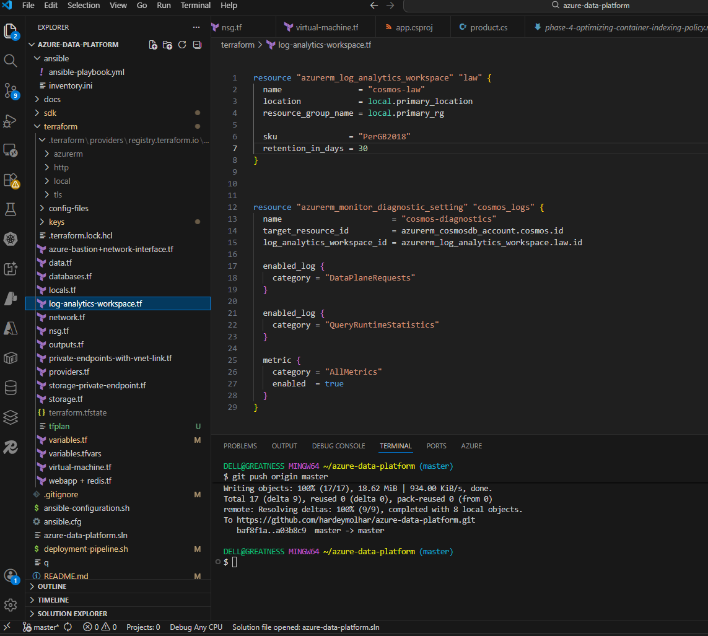
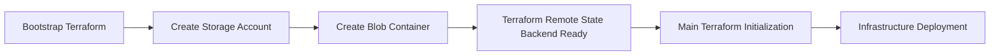
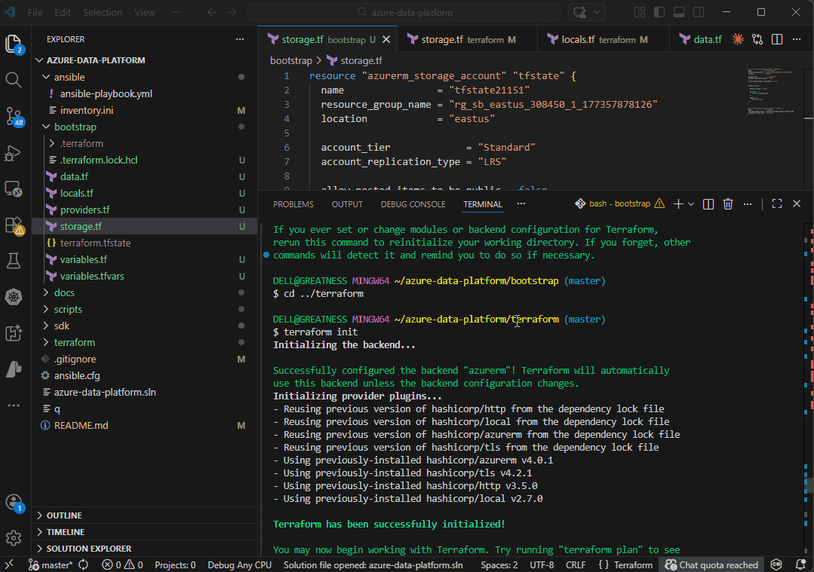
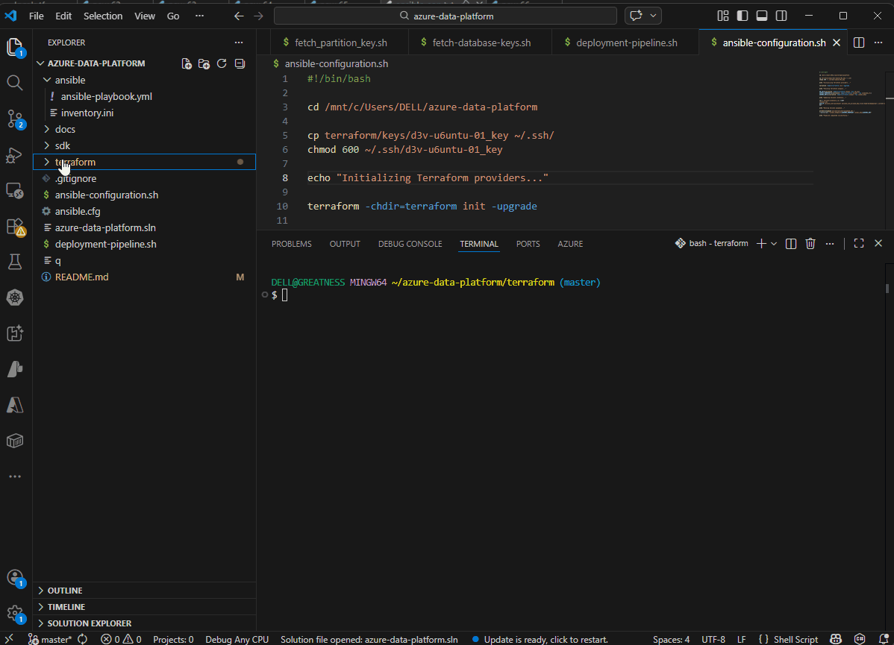
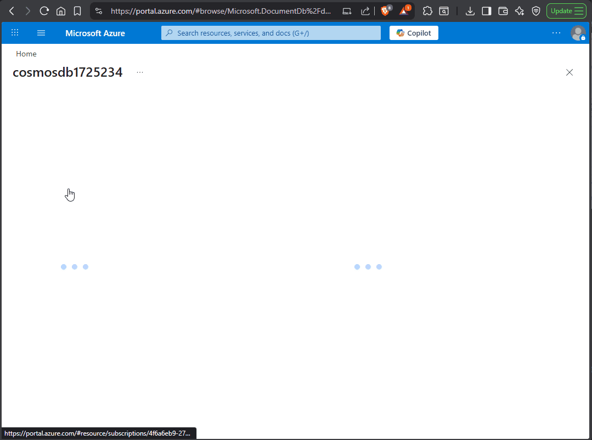

# Azure Cosmos DB Data Platform — Automated Ingestion with Terraform Infrastructure-as-Code and Remote State
A production-style data ingestion platform demonstrating **Cosmos DB transactional batching, Terraform infrastructure-as-code with remote state, and RU observability using Azure Monitor and Kusto Query Language (KQL).**
The project shows how **application-level batching strategies, automated infrastructure provisioning, and operational telemetry** can be combined to build a reproducible and observable Cosmos DB ingestion workflow.


# Problem

Large-scale ingestion workloads in Azure Cosmos DB can become inefficient when:

- writes are issued as individual operations
- infrastructure deployment is manual
- database performance is difficult to observe
- RU consumption patterns are not measurable

This project explores the engineering question:
```bash
How can we ingest large volumes of data into Cosmos DB
while keeping infrastructure reproducible
and minimizing Request Unit (RU) costs?
```

# Solution Overview
The platform combines
| Layer          | Technology                    |
| -------------- | ----------------------------- |
| Application    | .NET Cosmos DB SDK            |
| Infrastructure | Terraform                     |
| Configuration  | Ansible                       |
| Database       | Azure Cosmos DB               |
| Observability  | Azure Monitor + Log Analytics |
| Analysis       | Kusto Query Language (KQL)    |


# System Architecture



# Project Evolution
The platform was developed in incremental phases to isolate engineering challenges.

| Phase   | Objective                                     |
| ------- | --------------------------------------------- |
| Phase 1 | Validate Cosmos DB SDK connectivity           |
| Phase 2 | Implement transactional batch ingestion       |
| Phase 3 | Automate infrastructure provisioning          |
| Phase 4 | Optimize indexing policies and RU consumption |


Detailed documentation:

- [Phase 1 — SDK Connectivity](docs/phase-1-sdk-connection.md)
- [Phase 2 — Transactional Batch Operations](docs/phase-2-transactional-batch.md)
- [Phase 3 — Infrastructure Automation](docs/phase-3-infra-automation.md)

# Key Engineering Decisions

🤔 How do I ingest data efficiently?
- Used Cosmos DB TransactionalBatch API to reduce network overhead
- Grouped writes per partition to improve throughput efficiency
---


🤔 How do I automate monitoring of RU consumption after deployment and application interaction with the database?

Created log-analytics-monitor.sh bash scripts which fetches the workspace id automatically and ingest it into the monitoring KQL query.

 Used Kusto Query Language (KQL) to analyze:
- Request Unit (RU) consumption
- Batch ingestion costs


## Configuration Management

After infrastructure deployment, Ansible configures the virtual machine and prepares the environment for application execution.




## Reproducible Infrastructure

All cloud resources are provisioned using Terraform, including:

- Virtual Network
- Network Security Groups
- Service Endpoints
- Azure Virtual Machine
- Azure Cosmos DB Account
- Log Analytics Workspace
- Cosmos DB Diagnostic Settings

This ensures the entire platform — including observability — is fully reproducible from code.


# Observability and RU Monitoring
Cosmos DB diagnostic logs are configured during Terraform deployment, enabling operational telemetry from the moment the infrastructure is created.

Telemetry is streamed to Log Analytics Workspace where it can be analyzed using Kusto Query Language (KQL).

- Request Unit (RU) consumption
- Container activity
- Batch operation costs
- Throttling events (HTTP 429)

<p align="center">

</p>


Example query used during performance analysis:

``` bash
AzureDiagnostics
| where Category contains "DataPlane"
| where isnotempty(databaseName_s)
| where isnotempty(collectionName_s)
| summarize totalRU=sum(todouble(requestCharge_s))
  by bin(TimeGenerated,5m), databaseName_s, collectionName_s
| order by TimeGenerated desc
```

``` bash 
The file name can be found in azure-data-platform/terraform/config-files/log-analytics-monitor.sh
```

This allows engineers to observe ingestion workload behavior directly from diagnostic logs without having to log on to the portal.


---

# Infrastructure Automation

Infrastructure resources are provisioned using Terraform.

<p align="center">

</p>


---


## Terraform State Management

Infrastructure deployments are coordinated using Terraform remote state stored in Azure Blob Storage.

The backend is provisioned through a bootstrap configuration before the main infrastructure deployment.



<p align="center">  </p>


# Deployment Validation 
The deployment workflow validates each stage of the platform.

## Terraform Infrastructure Deployment

<p align="center">  </p>


## VM Connectivity Validation

<p align="center">  </p>

## Ansible Configuration

<p align="center">  </p>

## Batch Ingestion Execution

Cosmos DB Data Explorer showing documents inserted by the automated batch ingestion process

<p align="center">  </p>

## RU Monitoring
<p align="center">  </p>


