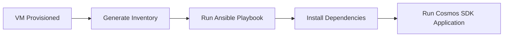

# Azure Cosmos DB Data Platform

End-to-end cloud data platform demonstrating infrastructure automation, application deployment, and high-efficiency ingestion using Azure Cosmos DB.

This project evolves through three phases:

1. SDK connectivity validation  
2. Efficient data ingestion using transactional batch operations  
3. Full infrastructure automation with Terraform and Ansible  

---

# System Architecture

The platform automates infrastructure provisioning, server configuration, and Cosmos DB ingestion using Infrastructure-as-Code and configuration management tools.

---

# Technology Stack

| Layer | Technology |
|-----|-----|
| Cloud | Microsoft Azure |
| Infrastructure as Code | Terraform |
| Configuration Management | Ansible |
| Database | Azure Cosmos DB |
| Application | .NET SDK |
| Networking | VNet, NSG, Service Endpoints |

---

# Project Phases

| Phase | Description |
|-----|-----|
| Phase 1 | Cosmos DB SDK connectivity validation |
| Phase 2 | Transactional batch ingestion engine |
| Phase 3 | Automated infrastructure deployment and orchestration |

Detailed documentation:

- [Phase 1 — SDK Connectivity](docs/phase-1-sdk-connection.md)
- [Phase 2 — Transactional Batch Operations](docs/phase-2-transactional-batch.md)
- [Phase 3 — Infrastructure Automation](docs/phase-3-infra-automation.md)

---

# Infrastructure Automation

Infrastructure resources are provisioned using Terraform.

Deployment workflow:

---

# Configuration Management

After infrastructure deployment, Ansible configures the virtual machine and prepares the environment for application execution.

# Configuration Management

After infrastructure deployment, Ansible configures the virtual machine and prepares the environment for application execution.

Execution Evidence

Terraform Infrastructure Deployment

  

VM Connectivity Validation

  

Successful Ansible Deployment

  

Cosmos DB Batch Execution

  

Key Engineering Decisions

- Used TransactionalBatch API to reduce Cosmos DB network overhead
- Implemented Terraform for reproducible infrastructure
- Adopted Ansible for server configuration instead of ad-hoc scripts
- Switched from Private Endpoints to Service Endpoints due to RBAC constraints