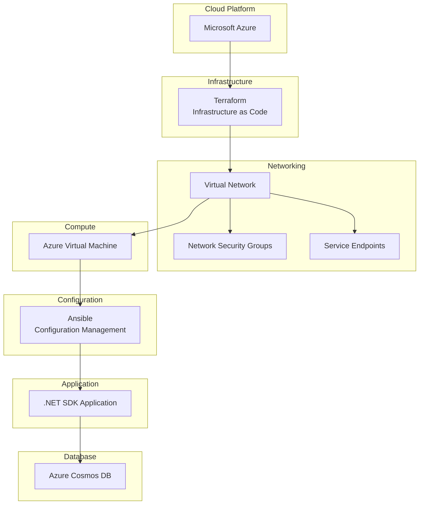
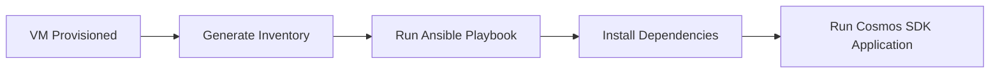
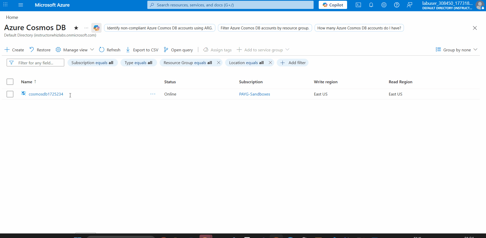

# Azure Cosmos DB Data Platform

This project explores how to build an automated data ingestion
platform for Azure Cosmos DB while maintaining fully reproducible
infrastructure and efficient batch operations.

The goal was to answer a practical engineering question:

```bash
 🤔 How might we efficiently ingest large volumes of data into Cosmos DB 
 while keeping infrastructure fully reproducible and automated?
```

To explore this, the platform evolves across three phases:
1. Validating Cosmos DB SDK connectivity
2. Designing a high-efficiency batch ingestion strategy
3. Automating the entire infrastructure and deployment pipeline
---


# System Architecture



## Key Engineering Decisions

- Used TransactionalBatch API to reduce Cosmos DB network overhead
- Implemented Terraform for reproducible infrastructure
- Adopted Ansible for server configuration instead of ad-hoc scripts
- Switched from Private Endpoints to Service Endpoints due to RBAC constraints
---

# Project Phases

| Phase | Description |
|-----|-----|
| Phase 1 | Cosmos DB SDK connectivity validation |
| Phase 2 | Transactional batch ingestion engine |
| Phase 3 | Automated infrastructure deployment and orchestration |

Detailed documentation:

- [Phase 1 — SDK Connectivity](docs/phase-1-sdk-connection.md)
- [Phase 2 — Transactional Batch Operations](docs/phase-2-transactional-batch.md)
- [Phase 3 — Infrastructure Automation](docs/phase-3-infra-automation.md)

---

# Infrastructure Automation

Infrastructure resources are provisioned using Terraform.

<p align="center">

</p>

Deployment workflow:


---

# Configuration Management

After infrastructure deployment, Ansible configures the virtual machine and prepares the environment for application execution.




# Deployment Validation 

Terraform Infrastructure Deployment

<p align="center">  </p>


VM Connectivity Validation

<p align="center">  </p>


<p align="center">  Successful Ansible Deployment  </p>

<p align="center">  </p>

Cosmos DB Data Explorer showing documents inserted by the automated batch ingestion process

<p align="center">  </p>

<p align="center">  </p>


