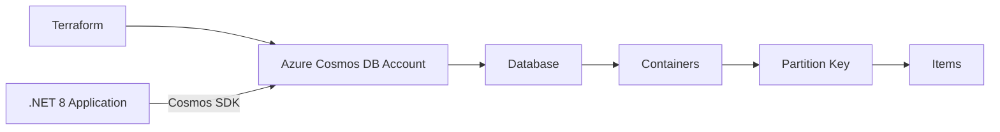
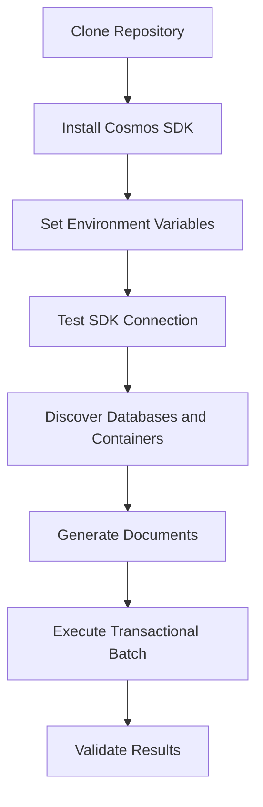

# STANDARD OPERATING PROCEDURE (SOP)

# Connecting to Azure Cosmos DB & Executing Transactional Batch Using .NET 8 SDK

---

## 🎯 OBJECTIVE

By the end of this procedure you will:

- Connect to Azure Cosmos DB (SQL API)
- Validate account connectivity
- Execute a transactional batch

---

# 📦 PREREQUISITES

Before starting, confirm the following are available.

## Azure Resources

You must have:

1.) An Azure Subscription or E-Learning Provided Lab

2.) Cosmos DB Account (SQL API)

3.) Database: **mycosmosdb**

4.) Container: As many as you want.

5.) Partition Key: **/categoryId**

6.) Throughput: **400 RU/s (manual or autoscale)**

---

## Local Tools

Install the following tools:

7.) .NET 8 SDK installed

8.) Git installed

9.) VS Code installed

---

## Repository

Clone the repository that will contain the SDK examples.

```bash
git clone https://github.com/microsoftlearning/dp-420-cosmos-db-dev
```

## Architecture Model



## Execution Flow


Now the reader understands the **entire workflow in 5 seconds**.

---

## 3. Repository Structure


## Repository Structure

```markdown
dp-420-cosmos-db-dev
│
├── 04-sdk-connect
│   ├── app.csproj
│   └── script.cs
│
├── 07-sdk-batch
│   ├── app.csproj
│   └── script.cs
```

## PHASE 1 — CONNECTING TO COSMOS DB

This phase verifies that the .NET SDK can successfully connect to your Cosmos DB account.

This phase assumes you have already deployed Azure Cosmos DB using the terraform code in "azure-data-platform".

### STEP 1 — Open Repository in VS Code

Navigate to the repository and open it in VS Code.

```bash
cd /cosmos-sdk/dp-420-cosmos-db-dev
code .
```

### STEP 2 — Navigate to SDK Connect Folder

Move to the SDK connectivity example.
```bash
cd 04-sdk-connect
```

Verify the files exist:

```bash
pwd
ls
```

You must see:

app.csproj
script.cs


### STEP 3 — Add Microsoft CosmosDB Package

Install the Cosmos DB SDK package.

```bash
dotnet add package Microsoft.Azure.Cosmos --version 3.*
```

If the package was already added:
```bash
dotnet restore
```


### STEP 4 — Export Cosmos Credentials (MANDATORY)

Open the integrated terminal inside VS Code.

Retrieve the primary key using Azure CLI.
```bash
#!/bin/bash

RESOURCE_GROUP="Rg_Name"
ACCOUNT_NAME="db_name"

az cosmosdb keys list \
  --name "$ACCOUNT_NAME" \
  --resource-group "$RESOURCE_GROUP" \
  --type keys \
  --query "primaryMasterKey" \
  --output tsv

echo "Primary Key:"
echo "$PRIMARY_KEY"
```
Set Environment Variables

```bash
export COSMOS_ENDPOINT="https://cosmosdb1725234.documents.azure.com:443/"
export COSMOS_KEY="PASTE YOUR KEY HERE"
```

Verify Variables
```bash
echo $COSMOS_ENDPOINT
echo $COSMOS_KEY
```

If blank → stop and correct the variables

Important:

If you close the terminal, variables disappear.

STEP 5 — Ensure script.cs Contains This Code

Verify the following code exists:

```csharp
using System;
using System.Linq;
using Microsoft.Azure.Cosmos;
using System.Threading.Tasks;
 
class Program
{
    static async Task Main(string[] args)
    {
        string endpoint = Environment.GetEnvironmentVariable("COSMOS_ENDPOINT");
        string key = Environment.GetEnvironmentVariable("COSMOS_KEY");
 
        CosmosClient client = new CosmosClient(endpoint, key);
 
        AccountProperties account = await client.ReadAccountAsync();
        Console.WriteLine($"Account Name:\t{account.Id}");
        Console.WriteLine($"Primary Region:\t{account.WritableRegions.FirstOrDefault()?.Name}");
    }
}
```
```text
This code:

Reads environment variables

Creates a CosmosClient

Fetches account metadata

Confirms connectivity
```

### STEP 6 — Execute

Run the application.

```bash
dotnet run
```

Expected Output:
```text
Account Name:   your_database_name
Primary Region: your_database_region
```

If this works → connectivity confirmed

## PHASE 2 — TRANSACTIONAL BATCH OPERATIONS

This phase demonstrates how to write multiple items to Cosmos DB in a single atomic batch.

### STEP 1 — Navigate to Batch Folder

Return to repository root then enter the batch example.

```bash
cd 07-sdk-batch
```

Verify the files:

```bash
pwd
ls
```

You must see:

```text
app.csproj
script.cs
```


### STEP 2 — Restore Packages
```bash
dotnet restore
```

### STEP 3 — Update script.cs 

First, we need to understand what the transactional batch logic will do:


Replace contents with:

```csharp
using System;
using System.Collections.Generic;
using System.Linq;
using System.Threading.Tasks;
using Microsoft.Azure.Cosmos;

public class Program
{
    public static async Task Main(string[] args)
    {
        string endpoint = Environment.GetEnvironmentVariable("COSMOS_ENDPOINT");
        string key = Environment.GetEnvironmentVariable("COSMOS_KEY");

        CosmosClient client = new CosmosClient(endpoint, key);

        FeedIterator<DatabaseProperties> dbIterator =
            client.GetDatabaseQueryIterator<DatabaseProperties>();

        while (dbIterator.HasMoreResults)
        {
            foreach (var dbProps in await dbIterator.ReadNextAsync())
            {
                Database database = client.GetDatabase(dbProps.Id);
                Console.WriteLine($"\nDatabase: {dbProps.Id}");

                FeedIterator<ContainerProperties> containerIterator =
                    database.GetContainerQueryIterator<ContainerProperties>();

                while (containerIterator.HasMoreResults)
                {
                    foreach (var containerProps in await containerIterator.ReadNextAsync())
                    {
                        Console.WriteLine($"  Container: {containerProps.Id}");

                        string pkPath = containerProps.PartitionKeyPath;
                        string pkProperty = pkPath.TrimStart('/');

                        Console.WriteLine($"    Partition Key: {pkProperty}");

                        Container container =
                            database.GetContainer(containerProps.Id);

                        string partitionValue = Guid.NewGuid().ToString();

                        List<Dictionary<string, object>> items = new();

                        for (int i = 1; i <= 200; i++)
                        {
                            items.Add(new Dictionary<string, object>
                            {
                                ["id"] = Guid.NewGuid().ToString(),
                                ["name"] = $"Item {i}",
                                [pkProperty] = partitionValue
                            });
                        }

                        int batchSize = 100;
                        int batchNumber = 1;

                        for (int i = 0; i < items.Count; i += batchSize)
                        {
                            var chunk = items.Skip(i).Take(batchSize);

                            TransactionalBatch batch =
                                container.CreateTransactionalBatch(
                                    new PartitionKey(partitionValue));

                            foreach (var item in chunk)
                            {
                                batch.CreateItem(item);
                            }

                            using TransactionalBatchResponse response =
                                await batch.ExecuteAsync();

                            Console.WriteLine(
                                $"      Batch {batchNumber} Status: {response.StatusCode}");

                            if (!response.IsSuccessStatusCode)
                            {
                                Console.WriteLine($"      Error: {response.ErrorMessage}");
                                break;
                            }

                            batchNumber++;
                        }
                    }
                }
            }
        }
    }
}
```


### STEP 4 — Execute Batch

```bash
dotnet run
```
## Expected Output

```text
Database: db3
  Container: permissions
    Partition Key: permissionId
      Batch 1 Status: OK
      Batch 2 Status: OK
  Container: profiles
    Partition Key: profileId
      Batch 1 Status: OK   
```