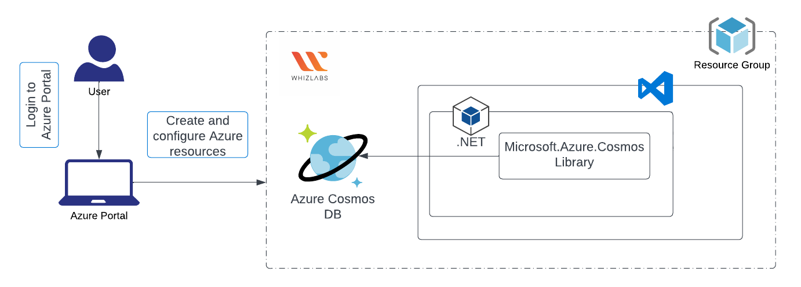
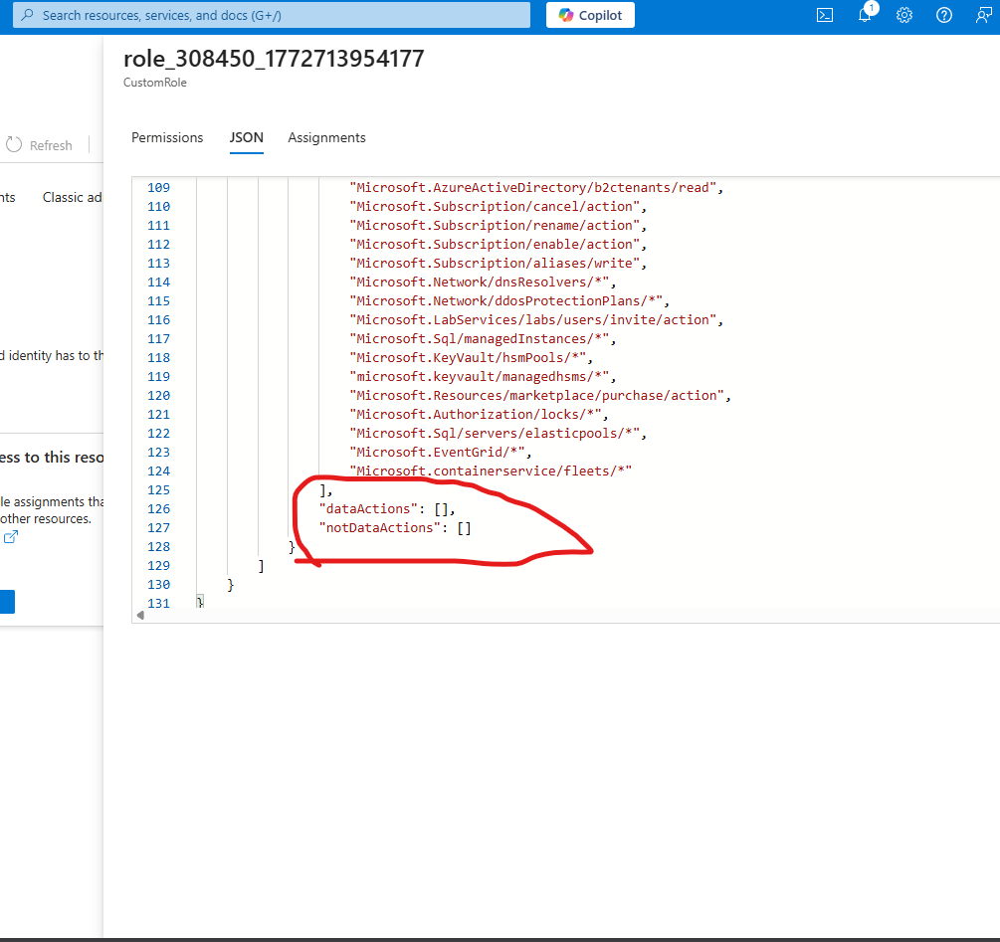
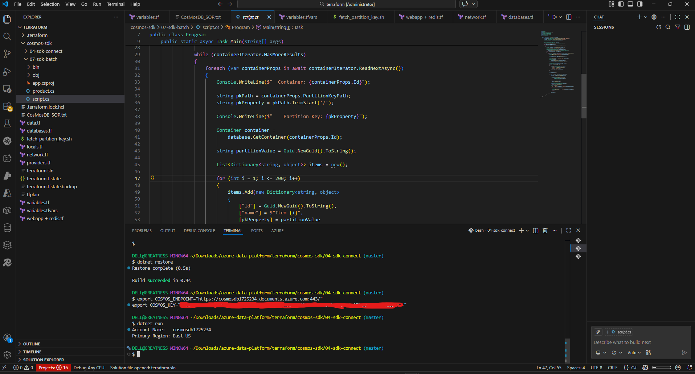

# Phase 1 — Establishing Azure Cosmos DB Connectivity Using the .NET SDK

## Architecture



---

## Problem Context

Applications interacting with Azure Cosmos DB require a reliable mechanism to authenticate and establish a connection before performing database operations.

Using the official Azure Cosmos DB SDK simplifies authentication, connection management, and retry handling.

---

## Engineering Decisions

### Credential Management & Key Vault Limitations

Azure Key Vault would normally be the preferred method for managing application secrets. However, the identity executing the application did not have Key Vault data-plane permissions. The assigned RBAC role only included management actions and did not define any `dataActions`, which are required to read secrets from a vault.

Because of this limitation, the application will be unable to retrieve credentials from Key Vault at runtime.




**Benefits**

- Improves security by separating credentials from application code
- Prevents credential leakage through version control
- Aligns with common cloud deployment practices where secrets are injected at runtime

---

## Technical Implementation

The application initializes a `CosmosClient` using credentials retrieved from environment variables.

```csharp
string endpoint = Environment.GetEnvironmentVariable("COSMOS_ENDPOINT");
string key = Environment.GetEnvironmentVariable("COSMOS_KEY");

CosmosClient client = new CosmosClient(endpoint, key);

AccountProperties account = await client.ReadAccountAsync();

Console.WriteLine($"Account Name: {account.Id}");
Console.WriteLine($"Primary Region: {account.WritableRegions.FirstOrDefault()?.Name}");
```


## Connectivity Verification

The connection to Azure Cosmos DB was validated using the .NET SDK by retrieving account metadata such as the account name and writable region.

The output confirms that the application successfully authenticated and established communication with the Cosmos DB account.



