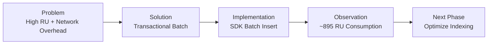
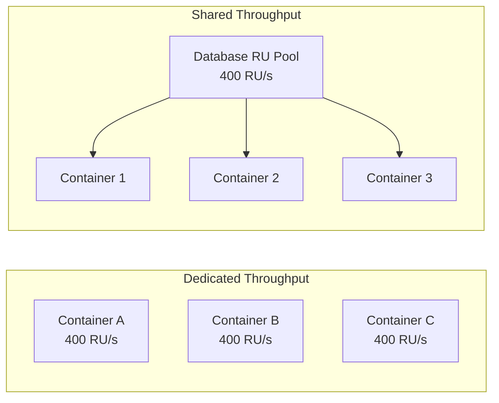
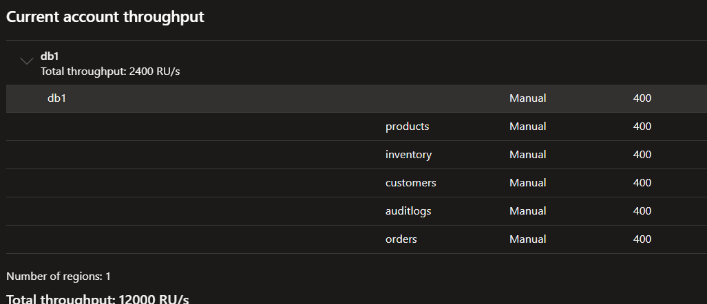
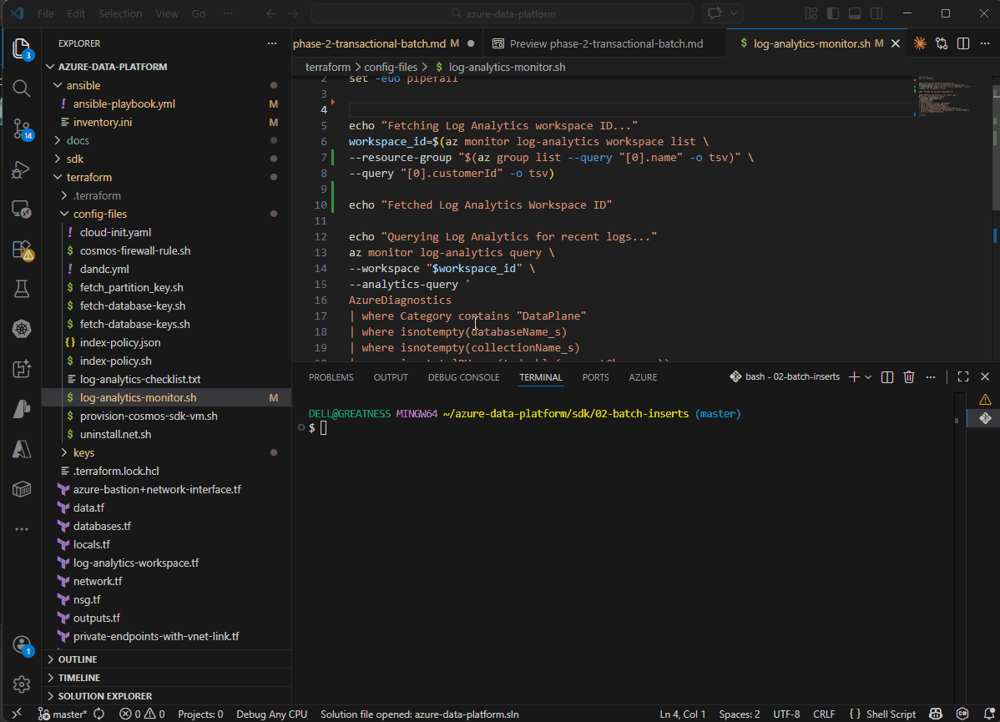
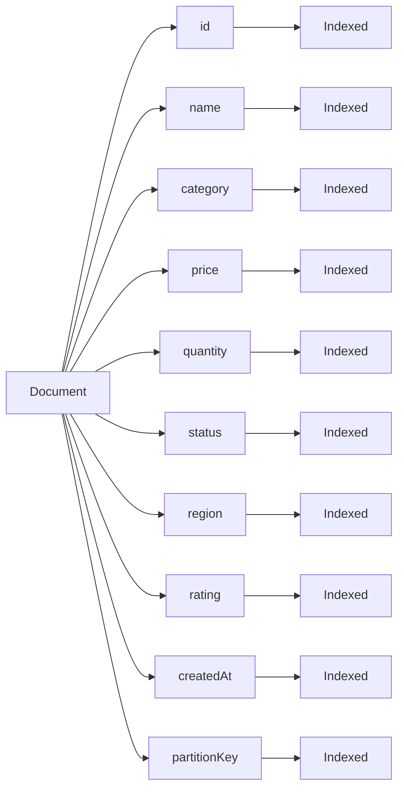
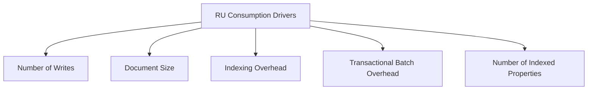

# Phase 2 — Transactional Batch Operations for Bulk Inserts



## Problem --> Outcome

**Problem**: Per-document inserts produced excessive network overhead and higher RU cost.

**Solution chosen**: TransactionalBatch for atomic multi-operation writes within the same partition, grouped into batches of 100 items. This reduces network round trips and enforces atomicity for batch items.

**Outcome observed**: Two batches inserting a total of 200 documents consumed ~895 RU (≈4.5 RU/document), matching the expected RU model given default indexing and document shapes.

### System Perspective

This workload represents a controlled write model where all operations are scoped to a single logical partition.

This design enables:
- deterministic RU measurement
- isolation of write cost from cross-partition effects
- predictable batch execution behavior

Trade-off:
- This introduces a hot partition scenario, prioritizing observability over scalability.
---

## Engineering Decisions

### Decision 1 - Use Transactional Batch

Transactional batch was selected to:

- reduce network calls
- improve write efficiency
- maintain atomic consistency within a partition

### Trade-off Analysis

| Benefit | Cost |
|--------|------|
| Reduced network round trips | Limited to single partition |
| Atomic operations | No horizontal scaling |
| Predictable RU consumption | Potential hot partition |

This decision intentionally prioritizes controlled experimentation over distributed system behavior.

---

### Decision 2 - Throughput Model Selection

```mermaid
xychart-beta
    title Dedicated vs Shared Throughput Tradeoff
    x-axis ["Cost Efficiency","Isolation","Operational Simplicity","Scalability"]
    y-axis Score 0 --> 10
    bar [9,3,9,6]
    bar [4,9,5,9]

```


<div align="center">

Legend

| Color | Throughput Model |
|------|------------------|
| Green | Dedicated Throughput |
| Blue | Shared Throughput |

#### Interpretation

Shared throughput scores higher for :
 cost efficiency and 
 operational simplicity 

Why?     because containers share a single RU pool.

Dedicated throughput scores higher for 
 isolation 
 scalability

Why?     each container has guaranteed RU allocation.


</div>


### Throughput Architecture




### Final Decision
```bash
Because this project runs inside a controlled lab environment, cost efficiency and simplicity were prioritized 
and it led to intentionally choosing database level shared throughput
```

### System Design Rationale

The workload generated by this phase is predictable and batch-oriented.

This makes shared throughput suitable because:
- RU consumption is controlled and bursty
- there is no need for strict isolation between containers
- cost efficiency is prioritized over guaranteed performance

Trade-off:
- Shared throughput introduces resource contention in multi-tenant scenarios, which is acceptable in this controlled setup.

| Factor | Reason |
|-------|--------|
| Predictable Workload | Batch operations generate controlled write volumes |
| Lab Environment | Not a production workload |
| Cost Efficiency | Prevents unused RU allocation |
---

# Configuration Screenshots

Throughputs were chosen one after the order in order to demonstrate how they actually work and look like in Azure

## Dedicated Throughput (Container Level)



---

## Shared Throughput Configuration


---

## Technical Implementation

Documents are grouped into batches of **100 items** and inserted using the Cosmos DB `TransactionalBatch` API.

```csharp
TransactionalBatch batch =
    container.CreateTransactionalBatch(
        new PartitionKey(partitionValue));

foreach (var item in chunk)
{
    batch.CreateItem(item);
}

TransactionalBatchResponse response =
    await batch.ExecuteAsync();
```

## Batch Model Execution


Each batch executes atomically within the specified partition key.

If any operation within the batch fails:

- the entire batch fails

- all operations are rolled back

- the transaction is not committed

### Workload Characteristics

This phase models a write-heavy workload with:

- fixed batch size (100 items)
- sequential execution
- single-partition targeting

This allows clear observation of:
- RU per batch
- RU per document
- impact of indexing on write cost


# OBSERVABILITY - RU CONSUMPTION REPORT

## CosmosDB Write Lifecycle 

When a client application inserts or updates a document in Azure Cosmos DB, the request travels through several internal components before the operation completes. Each stage performs work that contributes to the final Request Unit (RU) charge, which represents the amount of compute, memory, and I/O resources consumed by the operation.


## RU Consumption Calculation

### RU as a System Signal

RU consumption reflects the internal work performed by Cosmos DB, including:

- document writes
- index updates
- storage operations

This makes RU a key metric for:
- performance tuning
- cost optimization
- indexing strategy decisions

In this experiment, RU consumption was measured during the insertion of 200 documents using TransactionalBatch operations.





## Why Did this transaction consume 895.24 RU?

```bash
The transaction consumes 895.24 RU because it performs two transactional batches inserting 200 documents into a single logical partition in Azure Cosmos DB.
Also, The items use the default cosmosdb indexing policy which contains many **indexed fields**, so Cosmos must write the document + update multiple indexes, which increases RU consumption.
```
From the index policy shown above under cosmosdb data explorer, It is apparent that all paths are indexed:


The following are factors that drive RU consumption in azure cosmosdb



The next phases hopes to answer the engineering question
```bash
How might we reduce RU consumption while optimizing container indexing policy for common operations and specific queries
```

### Key Insight

The dominant contributor to RU consumption in this phase is indexing overhead.

Since all document properties are indexed by default:
- each write operation triggers multiple index updates
- RU cost increases proportionally with the number of indexed fields

This directly motivates the next phase:
index optimization based on actual query patterns.
