# Phase 2 — Transactional Batch Operations for Bulk Inserts

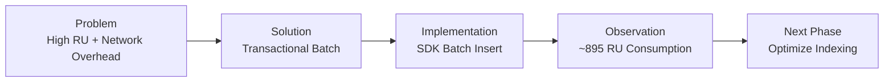

## Problem --> Outcome

**Problem**: Per-document inserts produced excessive network overhead and higher RU cost.

**Solution chosen**: TransactionalBatch for atomic multi-operation writes within the same partition, grouped into batches of 100 items. This reduces network round trips and enforces atomicity for batch items.

**Outcome observed**: Two batches inserting a total of 200 documents consumed ~895 RU (≈4.5 RU/document), matching the expected RU model given default indexing and document shapes.

---

## Engineering Decisions

### Decision 1 - Use Transactional Batch

Transactional batch was selected to:

- reduce network calls
- improve write efficiency
- maintain atomic consistency within a partition

---

### Decision 2 - Throughput Model Selection

```mermaid
xychart-beta
    title Dedicated vs Shared Throughput Tradeoff
    x-axis ["Cost Efficiency","Isolation","Operational Simplicity","Scalability"]
    y-axis Score 0 --> 10
    bar [9,3,9,6]
    bar [4,9,5,9]

```
<div align="center">

Legend

| Color | Throughput Model |
|------|------------------|
| Green | Dedicated Throughput |
| Blue | Shared Throughput |

#### Interpretation

Shared throughput scores higher for :
 cost efficiency and 
 operational simplicity 

Why?     because containers share a single RU pool.

Dedicated throughput scores higher for 
 isolation 
 scalability

Why?     each container has guaranteed RU allocation.


</div>


### Throughput Architecture

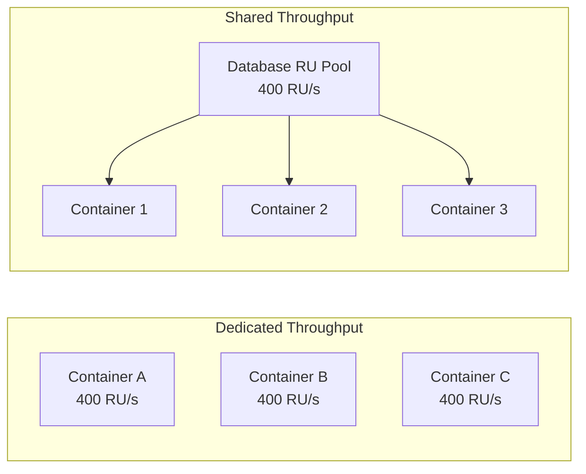


### Final Decision
```bash
Because this project runs inside a controlled lab environment, cost efficiency and simplicity were prioritized 
and it led to intentionally choosing database level shared throughput
```

| Factor | Reason |
|-------|--------|
| Predictable Workload | Batch operations generate controlled write volumes |
| Lab Environment | Not a production workload |
| Cost Efficiency | Prevents unused RU allocation |
---

# Configuration Screenshots

Throughputs were chosen one after the order in order to demonstrate how they actually work and look like in Azure

## Dedicated Throughput (Container Level)


---

## Shared Throughput Configuration


---

## Technical Implementation

Documents are grouped into batches of **100 items** and inserted using the Cosmos DB `TransactionalBatch` API.

```csharp
TransactionalBatch batch =
    container.CreateTransactionalBatch(
        new PartitionKey(partitionValue));

foreach (var item in chunk)
{
    batch.CreateItem(item);
}

TransactionalBatchResponse response =
    await batch.ExecuteAsync();
```

## Batch Model Execution

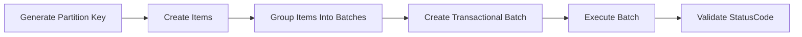

Each batch executes atomically within the specified partition key.

If any operation within the batch fails:

- the entire batch fails

- all operations are rolled back

- the transaction is not committed


# OBSERVABILITY - RU CONSUMPTION REPORT

## CosmosDB Write Lifecycle 

When a client application inserts or updates a document in Azure Cosmos DB, the request travels through several internal components before the operation completes. Each stage performs work that contributes to the final Request Unit (RU) charge, which represents the amount of compute, memory, and I/O resources consumed by the operation.

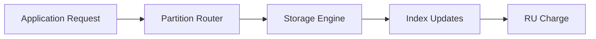

## RU Consumption Calculation
When performing write operations in Azure Cosmos DB, each request consumes Request Units (RU). A Request Unit represents the normalized cost of performing a database operation based on the amount of system resources consumed, including CPU, memory, disk I/O, and indexing overhead.

In this experiment, RU consumption was measured during the insertion of 200 documents using TransactionalBatch operations.

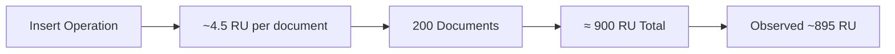


## Why Did this transaction consume 895.24 RU?

```bash
The transaction consumes 895.24 RU because it performs two transactional batches inserting 200 documents into a single logical partition in Azure Cosmos DB.
Also, The items use the default cosmosdb indexing policy which contains many **indexed fields**, so Cosmos must write the document + update multiple indexes, which increases RU consumption.
```
From the index policy shown above under cosmosdb data explorer, It is apparent that all paths are indexed:
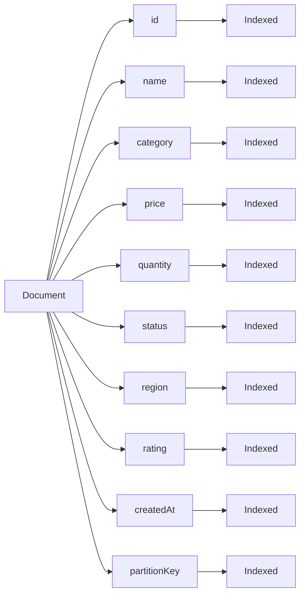

The following are factors that drive RU consumption in azure cosmosdb
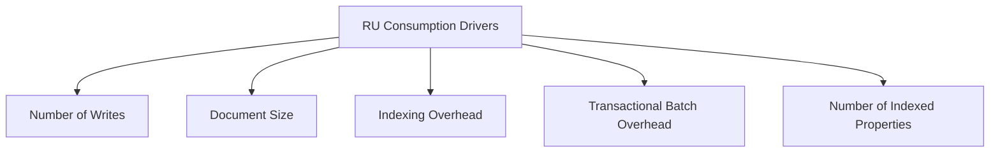


The next phases hopes to answer the engineering question
```bash
How might we reduce RU consumption while optimizing container indexing policy for common operations and specific queries
```

# Key Lessons From Phase 2

## Introducing Terraform Module Architecture
The initial Terraform configuration defined most infrastructure resources directly within a single configuration structure. While functional for experimentation, this approach becomes difficult to maintain as infrastructure grows.


Challenges included:

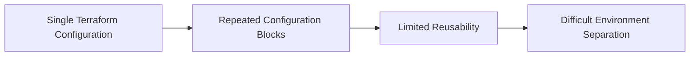
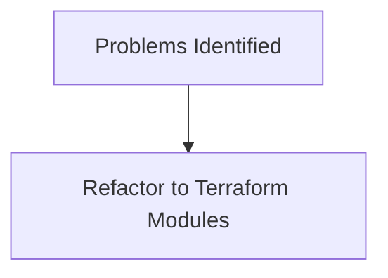


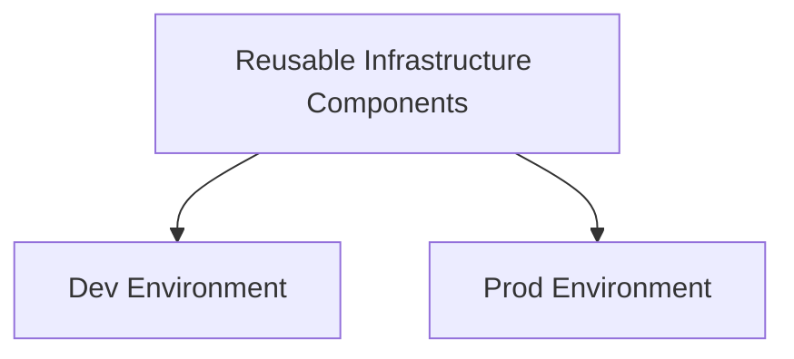


## Confusion Between Terraform Argument Types
What Happened

While implementing networking resources, I initially struggled with Terraform schema requirements regarding argument types such as:

-**string**

-**list(string)**

-**map(object(...))**

This led to an incorrect configuration where the expression was interpreted as a literal string instead of a variable reference.

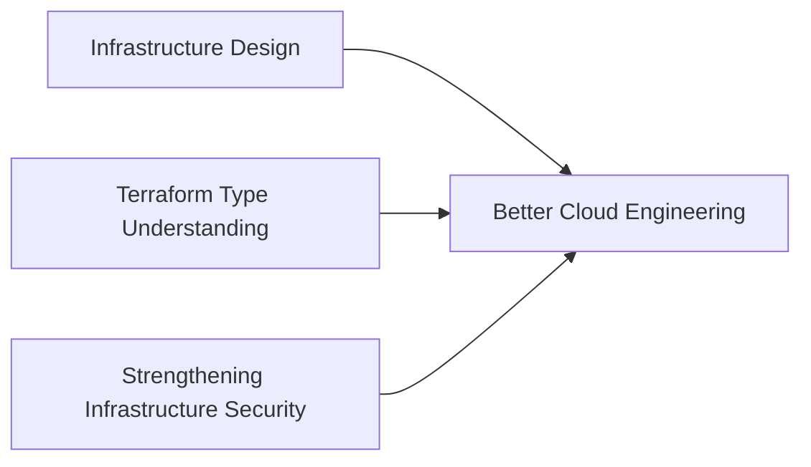