# Phase 3 --- Automated Infrastructure Deployment and System Orchestration


## Project Progression
```
  -----------------------------------------------------------------------
  Phase                               Focus
  ----------------------------------- -----------------------------------
  Phase 1                             Establish Cosmos DB connectivity
                                       | .NET SDK |

  Phase 2                             Implement high-efficiency ingestion 
                                       | Transactional Batch |

  Phase 3                             Automate infrastructure and deployment
                                       | Terraform, Ansible |
  -----------------------------------------------------------------------
  ```

Phase 3 transitions the project from manual testing to automated
deployment and execution.

------------------------------------------------------------------------

## System Architecture

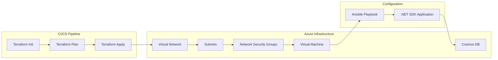

The architecture connects infrastructure provisioning, server
configuration, and application execution into one automated workflow.

------------------------------------------------------------------------

## Problem Context

In the earlier phases, key capabilities were validated manually:

-   The .NET SDK could authenticate and connect to Cosmos DB.
-   Transactional batch operations could insert documents efficiently.

However, several tasks still required manual execution:

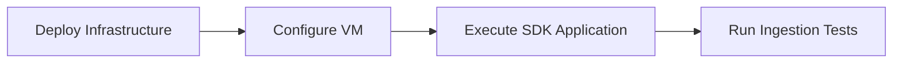

This made the environment difficult to recreate consistently.

------------------------------------------------------------------------

# Engineering Flow

The automation introduced in Phase 3 follows a structured progression.

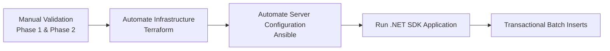

------------------------------------------------------------------------

# Infrastructure Deployment

## Terraform Resource Dependency Graph

This graph was generated using:

``` bash
terraform graph | dot -Tpng > terraform-graph.png

```

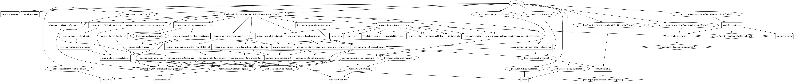

Infrastructure provisioning is automated using:

```bash
azure-data-platform/deployment-pipeline.sh
```
------------------------------------------------------------------------

# VM Connectivity Validation

Before configuration begins, the virtual machine must be reachable.

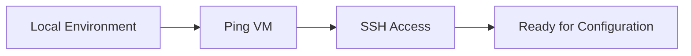

------------------------------------------------------------------------

## Ping Test to VM Using Ansible

```{=html}
<p align="center">
```
``{=html}
```{=html}
</p>
```
The ping test confirms that the virtual machine is reachable through the
configured network.

------------------------------------------------------------------------

# SSH Access to the VM

Once connectivity is confirmed, SSH access validates authentication and
network rules.

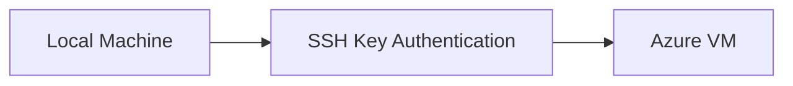

------------------------------------------------------------------------

## SSH Connection 


Successful SSH access confirms that the VM is ready for configuration.

------------------------------------------------------------------------

# Server Configuration

Once infrastructure is deployed, the virtual machine must be configured
before running the application.

Ansible automates this configuration.

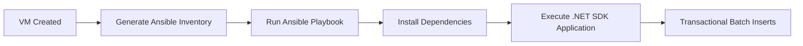
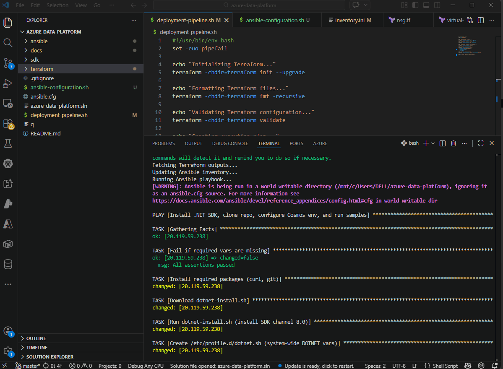

------------------------------------------------------------------------

# Private Endpoint Networking Constraint

## Planned Architecture

The original design used private networking for Cosmos DB access.

It included:

- Cosmos DB Private Endpoint
- Private DNS Zone
- VNet DNS link

However, Accessing a private endpoint requires network connectivity into the VNet.
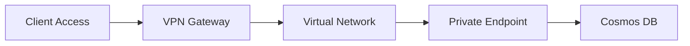

This normally requires:

- Point-to-Site VPN
- Site-to-Site VPN
- ExpressRoute

```bash
Deployment Constraint

Deployment of a Point-to-Site VPN gateway was not possible due to RBAC restrictions.
Without VPN access, the private endpoint could not be reached from the development environment.
```
## Architecture Adjustment

Because of this limitation, the architecture was modified to allow the application to connect to Cosmos DB without requiring VNet access.

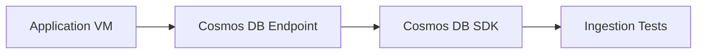

This adjustment enabled:
```bash
SDK execution
ingestion testing
application connectivity
```
while still allowing the infrastructure pipeline to be demonstrated.
Terraform configuration for this design exists in the project:

``` bash
terraform/private-endpoints-with-vnet-link.tf
```

This configuration defines:

-   Cosmos DB private endpoint
-   Private DNS zone
-   VNet DNS link

However, private endpoint access requires connectivity into the virtual
network through a VPN gateway.

Due to RBAC restrictions, deployment of a Point-to-Site VPN gateway was
not possible.

Because of this limitation, the architecture was adjusted.

------------------------------------------------------------------------

# Final Network Design

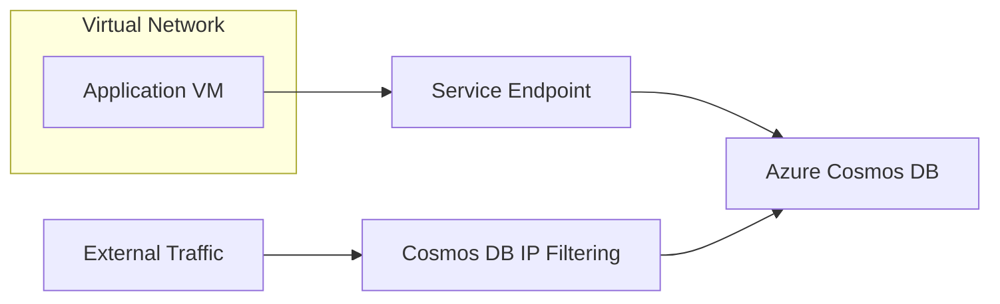

The final implementation uses:

-   Service Endpoints
-   Cosmos DB IP filtering
-   Application VM inside the VNet

This configuration allows the application to access Cosmos DB securely
without requiring a VPN.

------------------------------------------------------------------------

# Failures Encountered and Engineering Fixes

Documenting failures was an important part of this phase.

## 1. Private Endpoint Deployment Constraint

**Problem**

Private endpoints were implemented in Terraform but could not be used
because VPN gateway deployment required permissions not available under
the assigned RBAC role.

**Evidence**

    terraform/private-endpoints-with-vnet-link.tf

**Resolution**

The architecture was adjusted to use:

-   Service Endpoints
-   Cosmos DB IP filtering

This allowed the VM to communicate with Cosmos DB without VPN
connectivity.

------------------------------------------------------------------------

## 2. Secret Retrieval Limitation

Earlier phases attempted to follow best practice by retrieving
credentials from Key Vault.

However the executing identity lacked **data plane permissions**.

**Solution**

A script was created to retrieve Cosmos DB keys using the Azure CLI.

    fetch-keys.sh

This script retrieves the primary key directly from the Cosmos DB
account.

------------------------------------------------------------------------

## 3. Partition Key Validation

During ingestion testing it was necessary to confirm that containers
were configured with the expected partition keys.

A validation script was implemented:

    fetch_partition_key.sh

This script:

-   enumerates databases
-   lists containers
-   retrieves partition key paths

This ensured batch operations executed against the expected partition
structure.

------------------------------------------------------------------------

## 4. VM Environment Preparation

The VM initially lacked the environment required to execute the SDK
application.

Initial attempts using ad‑hoc scripts became complex and difficult to
maintain. After spending significant time attempting to make these
scripts idempotent, the approach was replaced with Ansible playbooks.

Ansible was introduced to:

-   install runtime dependencies
-   configure the development environment
-   prepare the system for application execution

These configuration files are stored in:

    terraform/config-files/

------------------------------------------------------------------------

# Cosmos DB Application Execution

Once the environment is prepared, the .NET application connects to
Cosmos DB and executes batch operations.

```{=html}
<p align="center">
```
``{=html}
```{=html}
</p>
```
The ingestion logic uses transactional batch operations validated in
Phase 2.

------------------------------------------------------------------------

# End-to-End Workflow

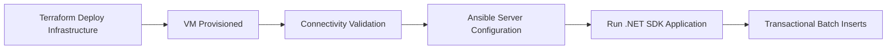

------------------------------------------------------------------------

# Measurable Outcome

  -----------------------------------------------------------------------
  Area                             Result
  -------------------------------- --------------------------------------
  Infrastructure                   Automated deployment using Terraform

  Server Setup                     Automated VM configuration using
                                   Ansible

  Connectivity                     Network access validated through ping
                                   and SSH

  Deployment                       Environment reproducible across
                                   deployments

  Data Ingestion                   Transactional batch operations
                                   executed automatically
  -----------------------------------------------------------------------

------------------------------------------------------------------------

# Key Lessons From Phase 3

## Infrastructure Automation Improves Reliability

Replacing manual setup with automated workflows allows the environment
to be recreated consistently.

## Design Must Adapt to Constraints

RBAC restrictions prevented deployment of the VPN gateway required for
private endpoints.

Adjusting the design to use service endpoints allowed the project to
proceed.

## Validation Scripts Improve Confidence

Scripts used to retrieve Cosmos DB keys and audit partition keys ensured
the deployed environment matched expected configuration.
