# Phase 3 --- Automated Infrastructure Deployment and System Orchestration Using Terraform Remote state

Phase 3 introduces infrastructure automation to replace the manual
environment used in earlier phases.

Terraform provisions Azure infrastructure while Ansible configures
the virtual machine and prepares the runtime environment required
for executing the Cosmos DB SDK ingestion application.

This phase transforms the project from manual experimentation
into a reproducible deployment pipeline.


| Phase         | Focus                            |
| ------------- | -------------------------------- |
| Phase 1       | Can the SDK connect              |
| Phase 2       | Can ingestion be optimized       |
| Phase 3       | Can the environment be automated |
| Observability | What does the system cost        |


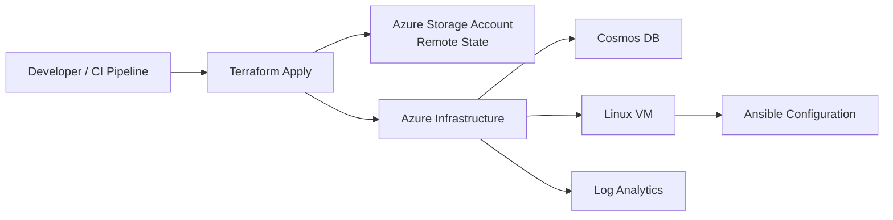


------------------------------------------------------------------------

## System Architecture

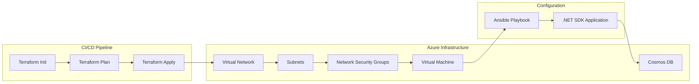

The architecture connects infrastructure provisioning, server
configuration, and application execution into one automated workflow.

------------------------------------------------------------------------

## Problem Context

In the earlier phases, key capabilities were validated manually:

-   The .NET SDK could authenticate and connect to Cosmos DB.
-   Transactional batch operations could insert documents efficiently.

However, several tasks still required manual execution:

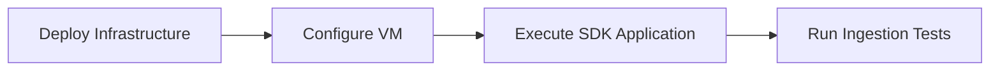

This made the environment difficult to recreate consistently.

------------------------------------------------------------------------


# Engineering Flow

The automation introduced in Phase 3 follows a structured progression.

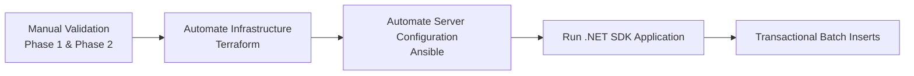

------------------------------------------------------------------------

# Infrastructure Deployment


## Terraform Resource Dependency Graph

This graph was generated using:

``` bash
terraform graph | dot -Tpng > terraform-graph.png

```


Infrastructure provisioning is automated using:

```bash
azure-data-platform/scripts/deployment-pipeline.sh
```
------------------------------------------------------------------------

# VM Connectivity Validation

Before configuration begins, the virtual machine must be reachable.

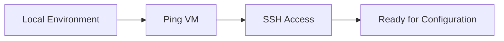
------------------------------------------------------------------------

# SSH Access to the VM

Once connectivity is confirmed, SSH access validates authentication and
network rules.

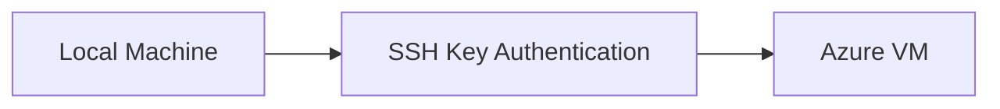

------------------------------------------------------------------------

## SSH Connection 


Successful SSH access confirms that the VM is ready for configuration.

------------------------------------------------------------------------

# Server Configuration

Once infrastructure is deployed, the virtual machine must be configured
before running the application.

Ansible automates this configuration.

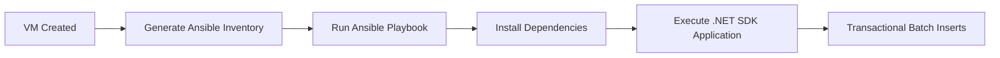


------------------------------------------------------------------------

# Private Endpoint Networking Constraint

## Planned Architecture

The original design used private networking for Cosmos DB access.

It included:

- Cosmos DB Private Endpoint
- Private DNS Zone
- VNet DNS link

However, Accessing a private endpoint requires network connectivity into the VNet.
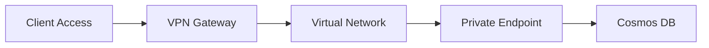

This normally requires:

- Point-to-Site VPN
- Site-to-Site VPN
- ExpressRoute

```bash
Deployment Constraint

Deployment of a Point-to-Site VPN gateway was not possible due to RBAC restrictions.
Without VPN access, the private endpoint could not be reached from the development environment.
```
## Architecture Adjustment

Because of this limitation, the architecture was modified to allow the application to connect to Cosmos DB without requiring VNet access.

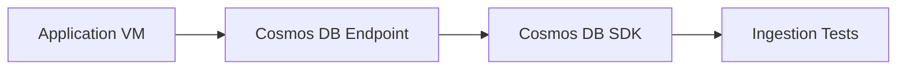

This adjustment enabled:

SDK execution
ingestion testing
application connectivity

while still allowing the infrastructure pipeline to be demonstrated.
Terraform configuration for this design exists in the project:

``` bash
terraform/private-endpoints-with-vnet-link.tf
```

This configuration defines:

-   Cosmos DB private endpoint
-   Private DNS zone
-   VNet DNS link

However, private endpoint access requires connectivity into the virtual
network through a VPN gateway.

Due to RBAC restrictions, deployment of a Point-to-Site VPN gateway was
not possible.

Because of this limitation, the architecture was adjusted.

------------------------------------------------------------------------

# Final Network Design

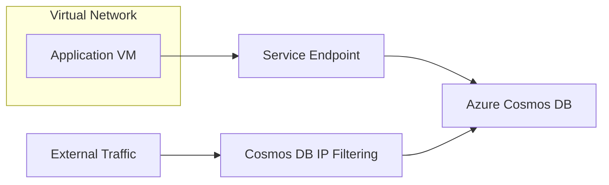

The final implementation uses:

-   Service Endpoints
-   Cosmos DB IP filtering
-   Application VM inside the VNet

This configuration allows the application to access Cosmos DB securely
without requiring a VPN.

------------------------------------------------------------------------

# Failures Encountered and Engineering Fixes

Documenting failures was an important part of this phase.

## 1. Private Endpoint Deployment Constraint

**Problem**

Private endpoints were implemented in Terraform but could not be used
because VPN gateway deployment required permissions not available under
the assigned RBAC role.

**Evidence**

    terraform/private-endpoints-with-vnet-link.tf

**Resolution**

The architecture was adjusted to use:

-   Service Endpoints
-   Cosmos DB IP filtering

This allowed the VM to communicate with Cosmos DB without VPN
connectivity.

------------------------------------------------------------------------

## 2. Secret Retrieval Limitation

Earlier phases attempted to follow best practice by retrieving
credentials from Key Vault.

However the executing identity lacked **data plane permissions**.

**Solution**

A script was created to retrieve Cosmos DB keys using the Azure CLI.

    fetch-keys.sh

This script retrieves the primary key directly from the Cosmos DB
account. The credentials were then exported using environment variables.

Ansible solved this problem

------------------------------------------------------------------------

## 3. Partition Key Validation

During ingestion testing it was necessary to confirm that containers
were configured with the expected partition keys.

A validation script was implemented:

    fetch-partition-key.sh

This script:

-   enumerates databases
-   lists containers
-   retrieves partition key paths

This ensured batch operations executed against the expected partition
structure.

------------------------------------------------------------------------

## 4. VM Environment Preparation

## VM Configuration

The provisioned VM initially lacked the runtime environment required to execute the Cosmos DB SDK application.

My initial approach used ad-hoc shell scripts to install dependencies and configure the environment. While functional, these scripts quickly became difficult to maintain and unreliable when rerun.

After spending significant time attempting to make the scripts idempotent, it became clear that a configuration management tool would provide a more maintainable solution. This led to the adoption of **Ansible playbooks**.

Ansible was used to:

- install required runtime dependencies
- configure the development environment
- prepare the VM to execute the ingestion application

The adhoc configuration scripts and ansible playbooks are located in:

```bash
\scripts\bootstraped-dotnet-installation.sh & ansible\ansible-playbook.yml
```

------------------------------------------------------------------------


# End-to-End Workflow

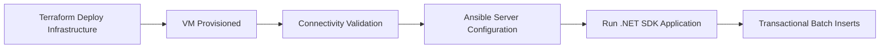

------------------------------------------------------------------------
| Area | Result |
|-----|------|
| Infrastructure | Automated with Terraform |
| Server Setup | Configured via Ansible |
| Connectivity | SSH + network validation |
| Deployment | Reproducible environment |
| Data Ingestion | Transactional batch automation |


------------------------------------------------------------------------

# Key Lessons From Phase 3

 ## Bootstrapping Remote State Requires a Controlled Initialization Sequence

The remote backend cannot be enabled until the backend infrastructure exists.

The correct initialization sequence is:

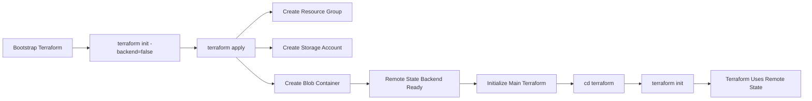

## Infrastructure Automation Improves Reliability

Replacing manual setup with automated workflows allows the environment
to be recreated consistently.


## Design Must Adapt to Constraints

RBAC restrictions prevented deployment of the VPN gateway required for
private endpoints.

Adjusting the design to use service endpoints allowed the project to
proceed.

## Validation Scripts Improve Confidence

Scripts used to retrieve Cosmos DB keys and audit partition keys ensured
the deployed environment matched expected configuration.
