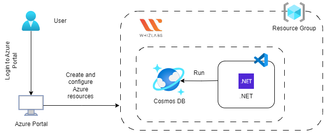
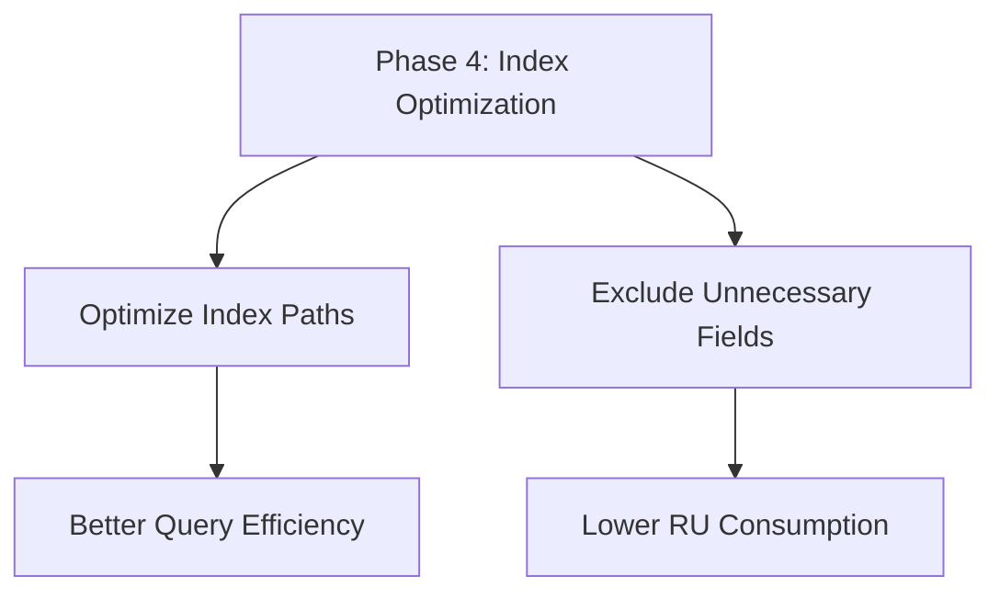
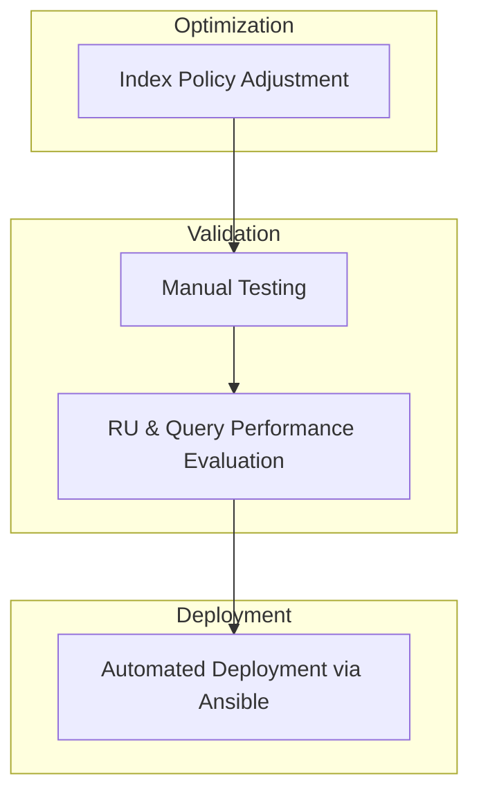

# Phase 4 — Cosmos DB Indexing Strategy & Terraform Module Refactoring
 

## Architecture Diagram




## Overview
By default, Azure Cosmos DB automatically indexes all properties of all items in your container without requiring you to specify any schema or create secondary indexes. 
Indexing policy can be customized to include or exclude specific paths to optimize for the read and write workloads of your application. 
Optimizing indexing policy can reduce costs and improve performance for specific types of operations. 


## Objective



## Index Optimization Validation Workflow



## Project Progression

```
-----------------------------------------------------------------------
Phase                               Focus
-----------------------------------------------------------------------
Phase 1                             Establish Cosmos DB connectivity
                                       | .NET SDK |

Phase 2                             Implement high-efficiency ingestion 
                                       | Transactional Batch |

Phase 3                             Automate infrastructure and deployment
                                       | Terraform, Ansible |

Phase 4                             Optimize CosmosDB index policy
                                       | Cosmos DB Indexing |
-----------------------------------------------------------------------
```


LEGACY IMPLEMENTATION (INITIAL DESIGN)

Originally, a single storage account was provisioned primarily to store
automation artifacts such as bootstrap scripts and configuration files.

At this stage of the project, Terraform state was still stored locally.
This approach worked for initial experimentation but presented several
limitations:

- State files were stored locally on the developer machine
- No centralized state management
- Risk of state drift or corruption
- Not suitable for collaborative workflows

As the infrastructure evolved and reproducibility became more important,
the design was upgraded to use a **remote Terraform backend stored in
Azure Blob Storage**. This allowed Terraform state to be centrally managed
and automatically locked during operations.

The implementation below is preserved for documentation purposes to
illustrate the early design phase of the project.

Replaced by:
Terraform Remote State Backend using Azure Storage.


Module Refactoring

After successfully setting up remote state, I decided it was time to refactor modules and I started. building a system to manage infrastructure for different environments like development and production.
At first, everything looked fine — the code ran, resources were created, and I could deploy one after the other, but then I asked, what would happen if i try to deploy across prod and dev together (in the same working directory)


The Problem

But over time, things started behaving unpredictably.

Sometimes the system couldn’t “see” resources that already existed

Other times, it tried to recreate things that were already there

And in some cases, deployments would block each other unexpectedly

It felt like I had built something that worked… but didn’t fully understand how it worked.


What I Realized

I discovered that the issue wasn’t the tool — it was how I structured things.

I had:

mixed different ways of separating environments

allowed parts of the system to depend on each other without clear boundaries

and assumed everything could “just access” what it needed

In reality, there was no clear structure defining who owns what.

🔹 The Decision

I decided to simplify and make everything explicit.

Instead of letting parts of the system reach into each other:

I made each part responsible for its own resources

I defined exactly what information could be shared

and I ensured every environment had a clearly separated state

🔹 The Change

After restructuring:

each environment became predictable

deployments stopped interfering with each other

and I could trace exactly where every piece of infrastructure came from

The system didn’t just work — it became understandable.

🔹 Key Lessons From Phase 4

This experience changed how I think about infrastructure.

I now design systems so that:

each part has clear ownership

dependencies are intentional, not accidental

and nothing relies on hidden assumptions