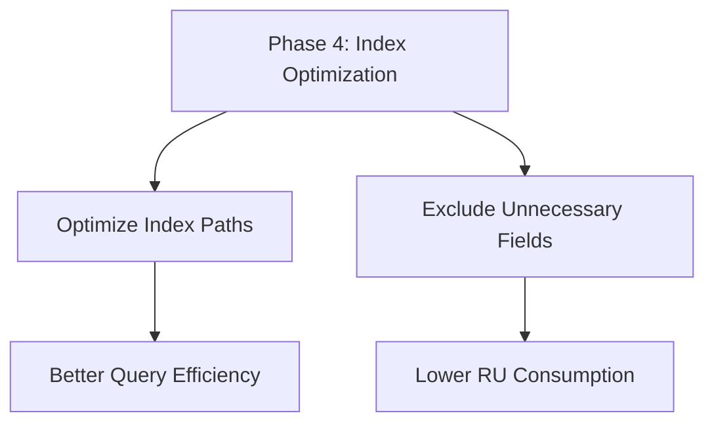
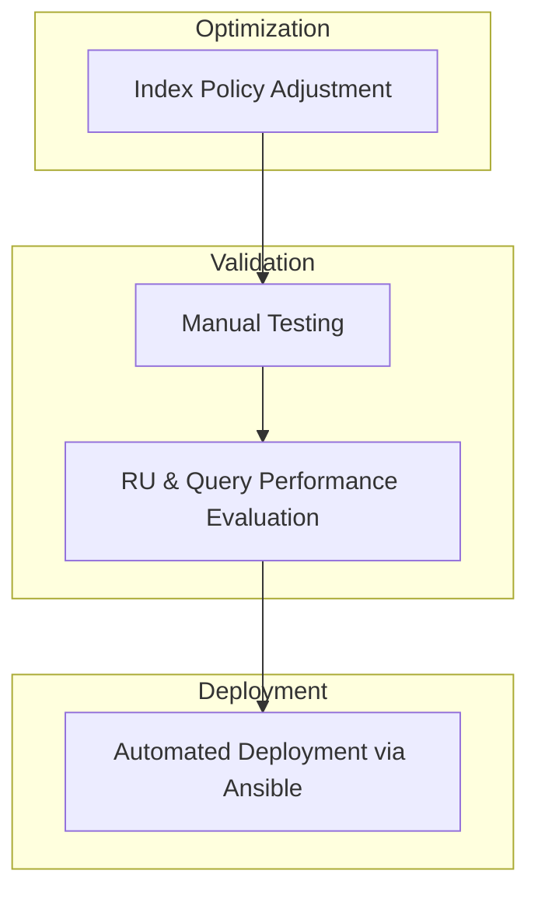

# Phase 4 - Optimizing an Azure Cosmos DB for NoSQL container’s indexing policy for common operations

## Architecture Diagram


## Overview
By default, Azure Cosmos DB automatically indexes all properties of all items in your container without requiring you to specify any schema or create secondary indexes. 
Indexing policy can be customized to include or exclude specific paths to optimize for the read and write workloads of your application. 
Optimizing indexing policy can reduce costs and improve performance for specific types of operations. 


## Objective



## Index Optimization Validation Workflow



## Project Progression

```
-----------------------------------------------------------------------
Phase                               Focus
-----------------------------------------------------------------------
Phase 1                             Establish Cosmos DB connectivity
                                       | .NET SDK |

Phase 2                             Implement high-efficiency ingestion 
                                       | Transactional Batch |

Phase 3                             Automate infrastructure and deployment
                                       | Terraform, Ansible |

Phase 4                             Optimize CosmosDB index policy
                                       | Cosmos DB Indexing |
-----------------------------------------------------------------------
```