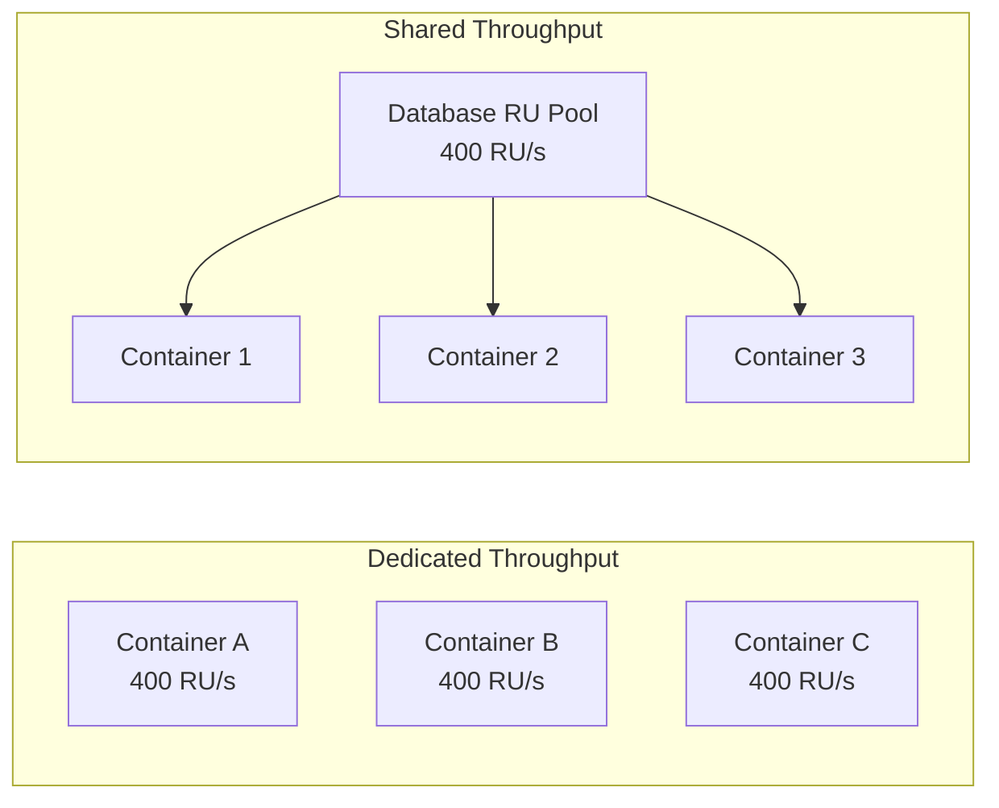
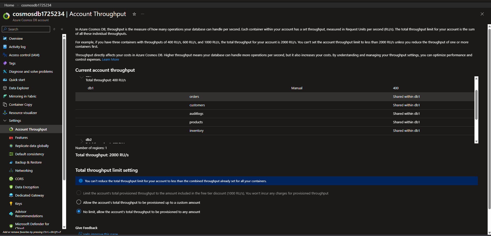
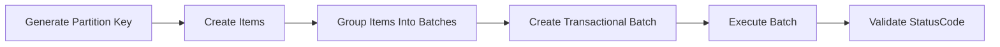
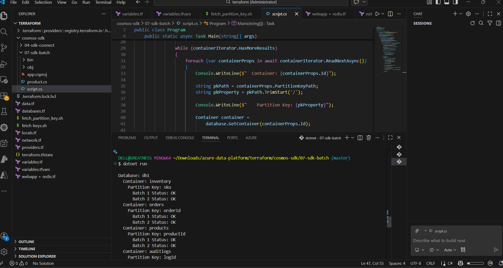
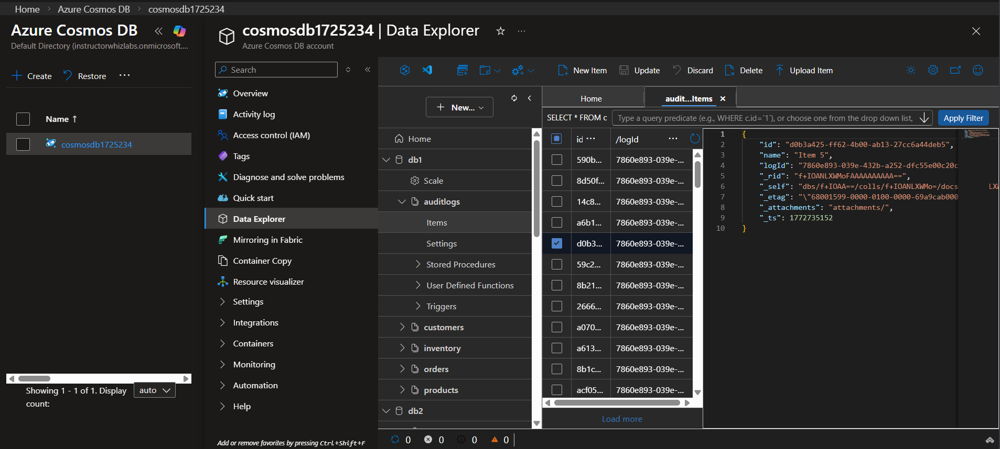
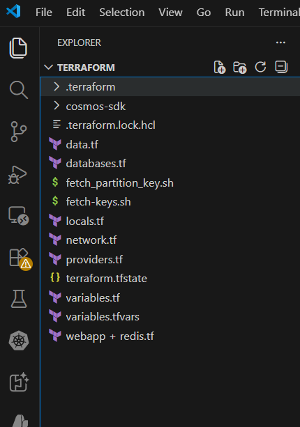
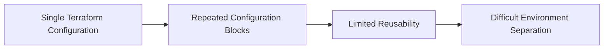
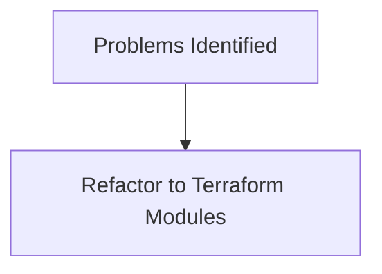
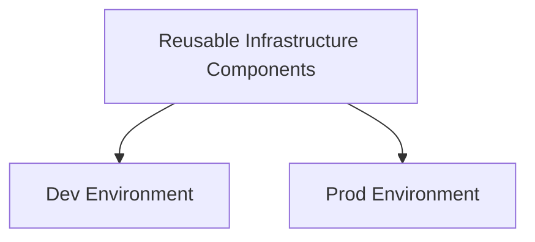
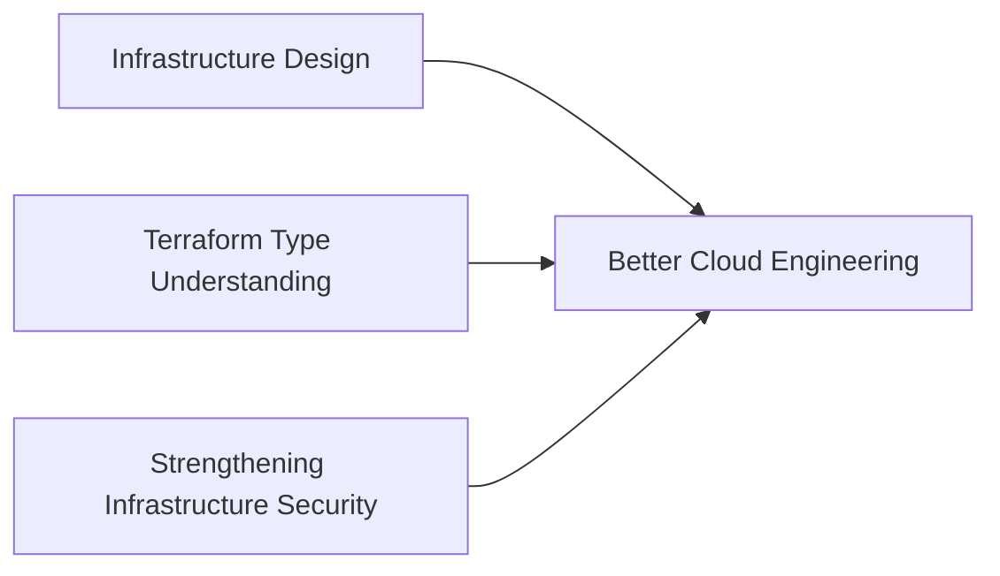

# Phase 2 — Transactional Batch Operations for Bulk Inserts

## Problem Context

Inserting documents individually increases network overhead and Request Unit (RU) consumption.

Azure Cosmos DB provides **Transactional Batch**, allowing multiple operations to execute atomically within a single partition key.

---

## Engineering Decisions

### Use Transactional Batch

Transactional batch was selected to:

- reduce network calls
- improve write efficiency
- maintain atomic consistency within a partition

---

### Throughput Model Selection

Azure Cosmos DB allows throughput to be configured either at the **container level (dedicated throughput)** or at the **database level (shared throughput)**.

#### Throughput Architecture



Key difference:

Dedicated throughput: each container has its own RU pool
Shared throughput: containers consume RU/s from a common database pool


### Decision Summary
In this project, **database-level shared throughput** was intentionally selected.

| Factor | Reason |
|-------|--------|
| Predictable Workload | Transactional batch operations generate controlled write volumes |
| Environment | Project executed in a lab / sandbox for SDK validation |
| Cost Efficiency | Shared RU pool prevents unused capacity across containers |
---

### Dedicated Throughput (Container Level)


Dedicated throughput assigns RU/s directly to a specific container. Each container must have its own provisioned throughput, which can lead to unused capacity if workloads are inconsistent.

---

### Shared Throughput (Database Level)



Shared throughput provisions RU/s at the database level, allowing multiple containers to share the same throughput pool. This improves resource utilization and reduces operational overhead.

---

## Technical Implementation

Documents are grouped into batches of **100 items** and inserted using the Cosmos DB `TransactionalBatch` API.

```csharp
TransactionalBatch batch =
    container.CreateTransactionalBatch(
        new PartitionKey(partitionValue));

foreach (var item in chunk)
{
    batch.CreateItem(item);
}

TransactionalBatchResponse response =
    await batch.ExecuteAsync();
```

## Batch Model Execution



Each batch executes atomically within the specified partition key.

If any operation within the batch fails:

- the entire batch fails

- all operations are rolled back

- the transaction is not committed







# Key Lessons From Phase 2

## Introducing Terraform Module Architecture
The initial Terraform configuration defined most infrastructure resources directly within a single configuration structure. While functional for experimentation, this approach becomes difficult to maintain as infrastructure grows.



Challenges included:








## Confusion Between Terraform Argument Types
What Happened

While implementing networking resources, I initially struggled with Terraform schema requirements regarding argument types such as:

-**string**

-**list(string)**

-**map(object(...))**

This led to an incorrect configuration where the expression was interpreted as a literal string instead of a variable reference.

